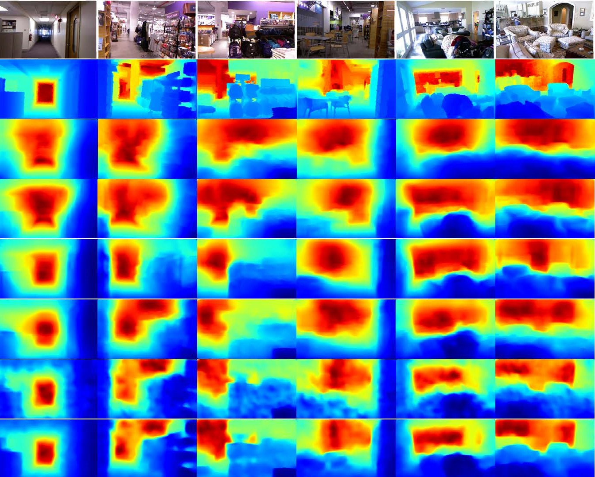
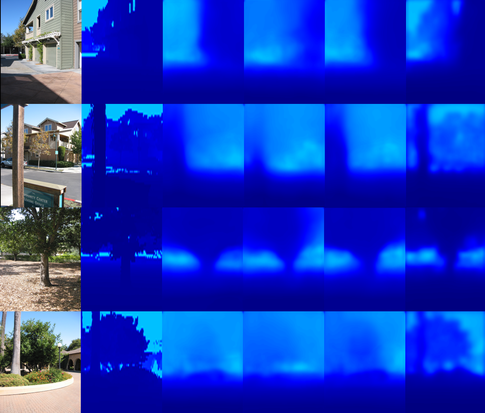

### Sparse Depth Densification

### Installation

Please install the corresponding libraries before running the code

~~~python
pip install -r requirements.txt
~~~

### data

+ Download NUYv2 dataset form [here](https://cs.nyu.edu/~silberman/datasets/nyu_depth_v2.html) 
+ Download Make3D dataset form [here](http://make3d.cs.cornell.edu/data.html) 

### Data Preparation

+ Using the method from *Unsupervised learning of image segmentation based on differentiable feature clustering(TIP 2020)*[[code](https://github.com/kanezaki/pytorch-unsupervised-segmentation-tip/)] [[paper](https://arxiv.org/abs/2007.09990)], we can get segmentation labels *G*.
+ SDM is obtained from["Sparse-to-Dense: Depth Prediction from Sparse Depth Samples and a Single Image(ICRA2018)"](https://arxiv.org/pdf/1709.07492.pdf)
+ RDM is obatained from["Parse Geometry from a Line: Monocular Depth Estimation with Partial Laser Observation"](https://arxiv.org/abs/1611.02174)

### Training

```bash
python train.py 
```
Pretrained Model can be found <a href="https://drive.google.com/file/d/1byhYi1zynmIOIzFC60I5Lr7jKat78Two/view?usp=sharing">here</a>.
### Testing 

```bash
python test.py 
```

### Results

**NYUv2**

+ The last three rows are the results of 150, 500 and 1000 depth points



**Make3D**

+ The last three columns show the results at 150, 500 and 1000 depth points.



### To do

\- [ ] Release the code about DDM and DEM

\- [ ] Due to the hasty time, the current code is relatively rough, later, we will continue to optimize the code, improve the code specification and add the necessary comments

### Acknowledgemets

+ Thanks to  [Revisiting_Single_Depth_Estimation](https://github.com/JunjH/Revisiting_Single_Depth_Estimation) and [sparse-to-dense](https://github.com/fangchangma/sparse-to-dense), the part of this project is referenced from these two projects.